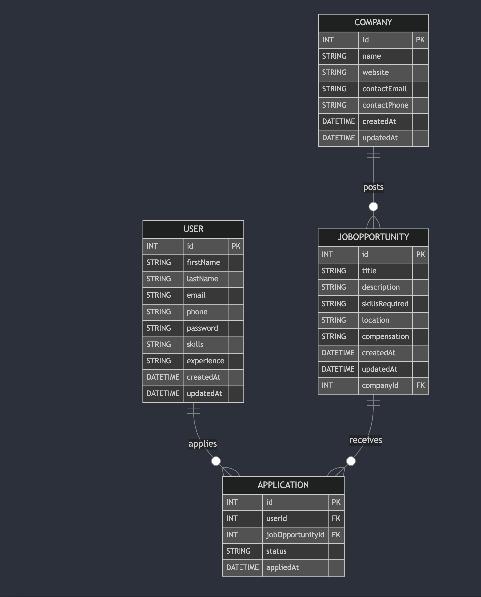

## frontend

initial setup
npm create vite@latest frontend -- --template react-ts

deploy vercel

.env ファイルを含めていないため、環境変数の設定は vercel の UI から実施

Tailwindow css + shadcn

## backend

参考：https://dev.classmethod.jp/articles/cdk-hono-crud-api-lambda-api-gateway-rds-aurora/#%25E7%2592%25B0%25E5%25A2%2583%25E6%25A7%258B%25E7%25AF%2589%25E9%2583%25A8%25E5%2588%2586
bun
hono
https://hono.dev/docs/getting-started/aws-lambda

```bash
cd iac
cdk deploy
```

prisma

```bash
# Prisma Client の生成
npx prisma generate

# マイグレーションの作成と適用
npx prisma migrate dev --name init

# ブラウザでDBを確認できる
npx prisma studio
```

## infra

aws cdk
setup:https://docs.aws.amazon.com/ja_jp/cdk/v2/guide/getting_started.html

how to deploy
iac

```bash
cd iac
cdk deploy

cdk deploy --all
```

## AWS 構成


## DB


