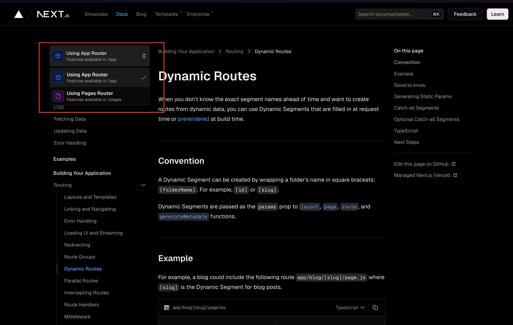
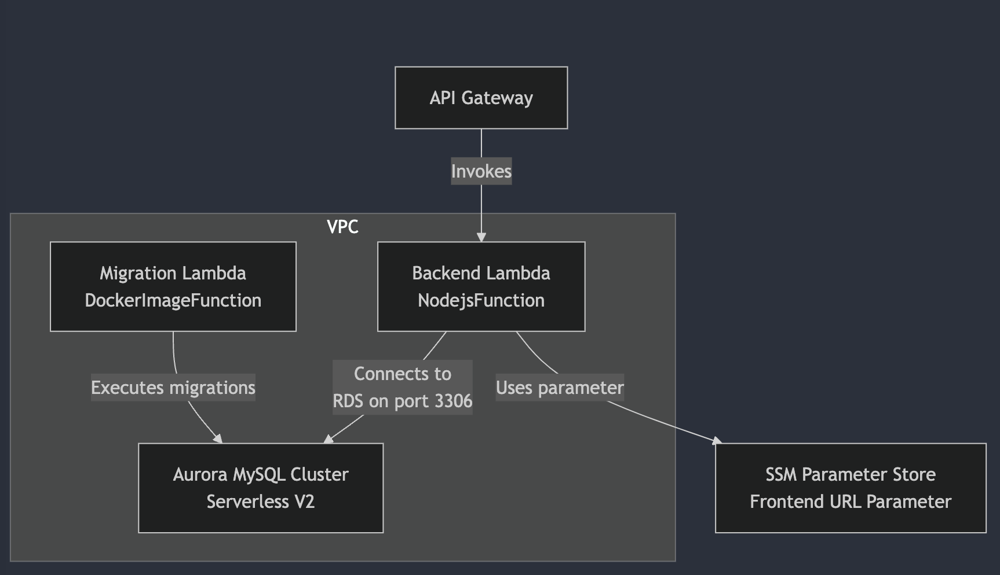
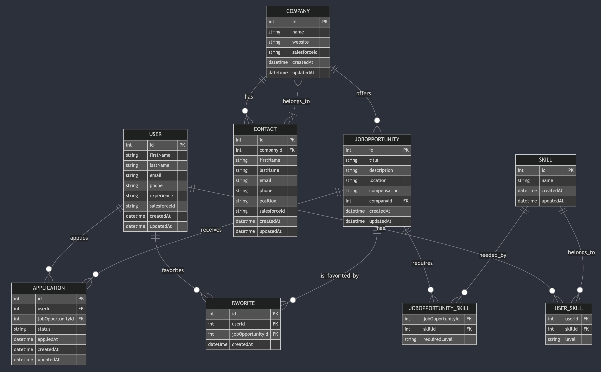

## frontend

initial setup
npm create vite@latest frontend -- --template react-ts

deploy vercel

.env ファイルを含めていないため、環境変数の設定は vercel の UI から実施

Tailwindow css + shadcn

nextjs15 には App Router と Page Router があることを知った
/app から始まるディレクトリ構成にしているか /pages から始まるディレクトリ構成にしているかで使うモジュールが変わってくるため、リファレンスを見るときは指定する必要がある


## backend

app（エントリポイント）はルーティングやミドルウェアの設定を担当、
controller は HTTP リクエストとレスポンスのやり取りに専念
logic 層ではビジネスロジックやバリデーション、データ変換などの処理
model 層はデータベースとのやり取りや ORM（Prisma など）の操作

参考：https://dev.classmethod.jp/articles/cdk-hono-crud-api-lambda-api-gateway-rds-aurora/#%25E7%2592%25B0%25E5%25A2%2583%25E6%25A7%258B%25E7%25AF%2589%25E9%2583%25A8%25E5%2588%2586
bun
hono
https://hono.dev/docs/getting-started/aws-lambda

```bash
cd iac
cdk deploy
```

prisma

```bash
cd backend/lambda/src

# マイグレーションファイルの作成と適用
npx prisma migrate dev --name init

# 2回目以降は任意の名前 example
npx prisma migrate dev --name add_favorites

# Prisma Client の生成 通常、上記の migrate コマンドで自動的に生成されますが、念のため以下のコマンドを実行
npx prisma generate

# ブラウザでDBを確認できる
npx prisma studio
```

## infra

aws cdk
setup:https://docs.aws.amazon.com/ja_jp/cdk/v2/guide/getting_started.html

how to deploy
iac

```bash
cd iac

cdk deploy

cdk deploy --all

# 削除
cdk destroy --all --force
aws cloudformation delete-stack --stack-name RdsStack --retain-resources MigrationCustomResource
```

## AWS 構成



## DB


